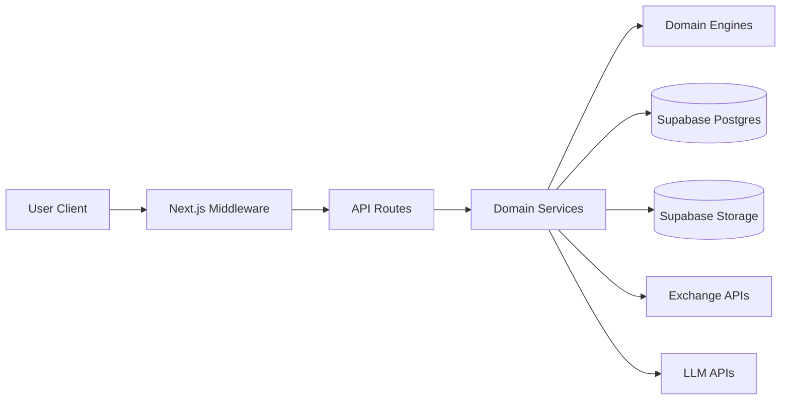

# Kiến Trúc Hệ Thống - Track PNL Pro

Tài liệu này mô tả kiến trúc thực tế đang chạy trong codebase `src/`.

## 1. Tổng quan kiến trúc

## 2. Layer và trách nhiệm

- Presentation: `src/app`, `src/components`
- Application: `src/app/api`
- Domain: `src/lib/services`, `src/lib/engines`
- Infrastructure: `src/lib/db`, `src/lib/adapters`

Quy tắc vận hành:

- API route luôn xác thực user trước khi xử lý nghiệp vụ.
- Validate input bằng Zod tại biên request.
- Service xử lý nghiệp vụ, DB module xử lý truy vấn.

## 3. Module map

- Auth + route guard: `src/middleware.ts`, `src/app/api/auth/*`
- PNL: `src/app/api/pnl/*`, `src/lib/services/pnlService.ts`, `src/lib/engines/pnlEngine.ts`
- Exchange: `src/app/api/exchange/*`, `src/lib/services/exchangeService.ts`, `src/lib/adapters/*`
- Demo trading: `src/app/api/demo/*`, `src/lib/services/demoService.ts`, `src/lib/engines/demoEngine.ts`
- AI chat: `src/app/api/ai/*`, `src/lib/services/aiService.ts`, `src/lib/agent-loop.ts`
- Profile: `src/app/api/profile/*`, `src/lib/services/profileService.ts`

## 4. API surface (thực tế)

- AI: `/api/ai/chat`, `/api/ai/conversations`, `/api/ai/conversations/[id]`, `/api/ai/conversations/[id]/messages`
- Auth: `/api/auth/account`, `/api/auth/callback`
- Demo: `/api/demo/order`, `/api/demo/order/[id]/close`, `/api/demo/orders`
- Exchange: `/api/exchange/connect`, `/api/exchange/sync`, `/api/exchange/accounts`, `/api/exchange/accounts/[id]`, `/api/exchange/balance/[id]`, `/api/exchange/positions/[id]`, `/api/exchange/debug/verify`
- PNL: `/api/pnl/overview`, `/api/pnl/summary`, `/api/pnl/chart`, `/api/pnl/calendar`, `/api/pnl/trades`, `/api/pnl/assets`
- Profile: `/api/profile`, `/api/profile/avatar`
- Health: `/api/healthz`, `/api/ping`

## 5. Dữ liệu và bảo mật

Nguồn dữ liệu chính:

- Supabase tables: `users`, `exchange_accounts`, `api_keys`, `trades`, `demo_trades`, `chat_conversations`, `chat_messages`
- API keys được mã hóa tại `src/lib/adapters/encryption.ts`

Kiểm soát bảo mật:

- Middleware chặn route protected khi chưa đăng nhập.
- API keys không trả về client.
- RLS và kiểm tra `user_id` xuyên suốt các truy vấn dữ liệu.
