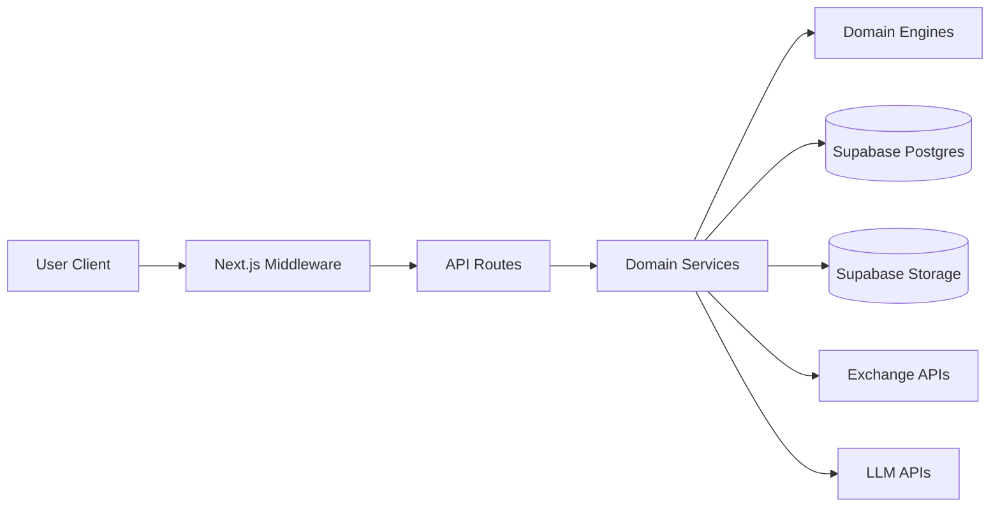
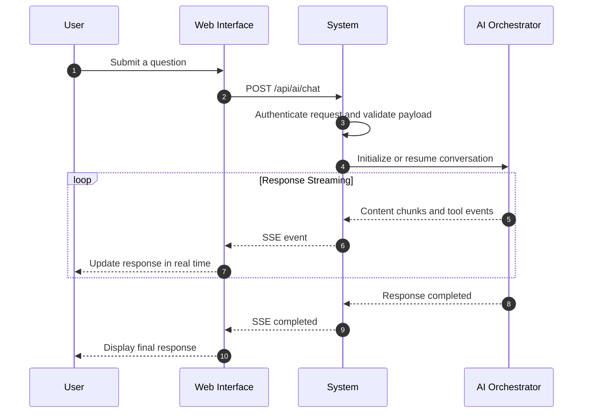
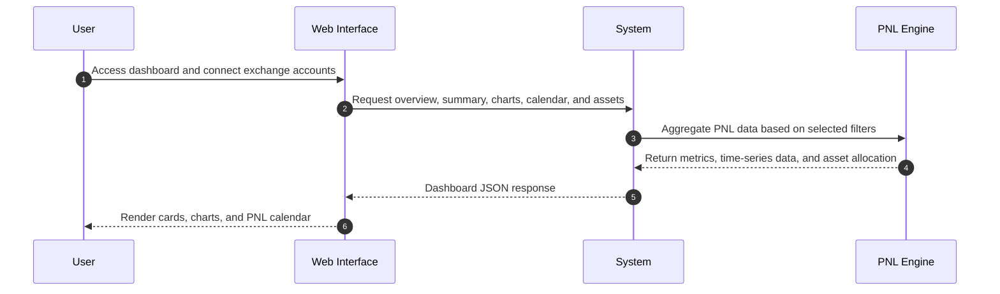

# System Architecture

## Overview

Track PNL Pro follows a layered architecture that separates presentation, business logic, domain processing, and infrastructure integrations. This design improves maintainability, scalability, and testability.

### Architecture



## Core Layers

### Presentation Layer

Responsible for user interaction and data visualization.

**Main directories**

```text
src/app
src/components
```

**Responsibilities**

* Dashboard and analytics UI
* Demo trading interface
* AI chat interface
* User profile management
* Authentication flows

---

### Application Layer

Acts as the entry point for requests and coordinates business operations.

**Main directory**

```text
src/app/api
```

**Responsibilities**

* Request validation
* Authentication and authorization
* Session handling
* Service orchestration

---

### Domain Layer

Contains the core business logic of the platform.

**Main directories**

```text
src/lib/services
src/lib/engines
```

**Responsibilities**

* PNL calculation
* Portfolio aggregation
* Demo trading execution
* Exchange synchronization
* AI workflow orchestration

---

### Infrastructure Layer

Handles communication with external systems and data sources.

**Main directories**

```text
src/lib/db
src/lib/adapters
```

**Responsibilities**

* Database access
* Exchange integrations
* AI provider integrations
* File storage management

---

## Core Modules

### Authentication & Security

Manages user authentication, authorization, and protected routes.

### Portfolio & PNL Analytics

Aggregates trading data from multiple exchanges and calculates performance metrics.

### Exchange Integration

Synchronizes balances, positions, and trade history from supported exchanges.

### Demo Trading Engine

Provides a risk-free trading environment with realistic order execution and PNL simulation.

### AI Assistant

Implements an agentic AI workflow with:

* Retrieval-Augmented Generation (RAG)
* Tool Calling
* Market Data Retrieval
* Crypto News Retrieval
* Conversation Memory
* Real-time Streaming (SSE)



### User Profile Management

Handles account settings, avatars, exchange connections, and synchronization preferences.

---

## Data Flow



Typical workflow:

1. User interacts with the web application.
2. Requests pass through the application layer.
3. Business logic is processed by domain services and engines.
4. Data is retrieved from databases or external providers.
5. Results are aggregated and returned to the user interface.

