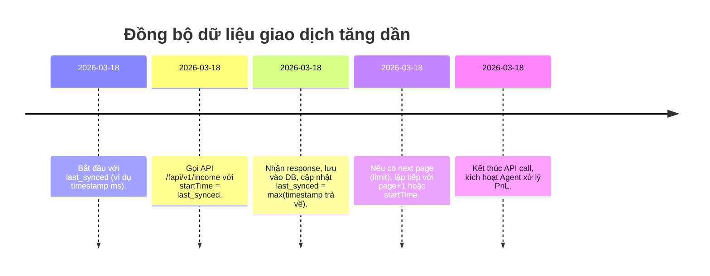

# Tóm lược và Kiến trúc tổng quát

Để xây dựng hệ thống **tracking PnL** từ lịch sử giao dịch (spot/futures) cho 4 sàn (Binance, OKX, Bybit, Bitget), ta cần chọn **đúng endpoint PnL-ready** nếu có, hoặc ngược lại là **lấy lịch sử giao dịch để tự tính PnL**. Mỗi sàn có cấu trúc API và cách phân trang riêng biệt, do đó ta nên thiết kế **Adapter Layer** để chuẩn hóa dữ liệu và sau đó đẩy về _PnL Engine_. 

**Điểm chính:**  
- **Endpoints PnL-ready (ưu tiên):** trả về PnL (closed pnl, income, bills) đã tính sẵn (bao gồm phí, funding…).  
- **Endpoints Trade/Order (dự phòng):** chỉ trả về thông tin giao dịch/bill, cần tự tính PnL.  
- **Hạn chế:** nhiều sàn giới hạn thời gian (ví dụ max 7 ngày/phản ánh), cần sync tăng dần theo timestamp hoặc cursor.  

Ta sẽ liệt kê chi tiết cho từng sàn:

## Binance

### 1. Endpoints ưu tiên (PnL-ready)

- **Futures (USDⓈ-M):**  
  - **GET `/fapi/v1/income`** – lấy lịch sử *Income* (PnL, phí, funding, rebate, …)【4†L125-L133】.  
    - **Auth:** HMAC SHA256 (Signature), truyền header hoặc query `timestamp` và `recvWindow`.  
    - **Tham số chính:**  
      - `symbol` (tuỳ chọn); `incomeType` lọc (ví dụ `REALIZED_PNL` để chỉ lấy PnL đã hiện thực).  
      - `startTime`, `endTime` (ms) cho khoảng thời gian (khoảng trả về mặc định 7 ngày nếu không có)【4†L111-L119】.  
      - `limit` (mặc định 100, max 1000); phân trang bằng `page` (hoặc `limit`).  
    - **Giới hạn:** Weight=30; hỗ trợ query 3 tháng gần nhất【4†L118-L124】.  
    - **Ví dụ response:** mỗi bản ghi có `"income": "-0.37500000"` (số tiền thay đổi), `"incomeType"` (loại: `REALIZED_PNL`, `FUNDING_FEE`,…), `"symbol"`, `"asset"`, `"fee"` (ví dụ trả về trong incomeType=COMMISSION nếu có) và `"time"` (timestamp)【4†L125-L133】.  

- **(Backup) Futures:**  
  - **GET `/fapi/v1/userTrades`** – lấy lịch sử giao dịch (trade) futures【39†L130-L138】.  
    - **Auth:** HMAC SHA256.  
    - **Tham số:** `symbol` (bắt buộc), `startTime`, `endTime` (max 7 ngày), `fromId` (tradeId)【39†L110-L119】.  
    - **Rate-limit:** Weight=5; chỉ hỗ trợ 6 tháng gần nhất【39†L122-L130】.  
    - **Response:** có các trường `"realizedPnl"` (PnL mỗi trade), `"commission"`, `"price"`, `"qty"`, `"side"` và `"time"`【39†L131-L140】.

- **Spot (không có PnL-ready):**  
  - **GET `/api/v3/myTrades`** – lịch sử trade spot【41†L497-L505】.  
    - **Auth:** HMAC SHA256.  
    - **Tham số:** `symbol` (bắt buộc), `startTime`, `endTime` (max 24h), `fromId` (tradeId), `limit`【41†L463-L472】.  
    - **Rate-limit:** Weight 20 (tùy điều kiện)【41†L497-L505】.  
    - **Response:** gồm `"price"`, `"qty"`, `"commission"`, `"time"`,… (cần tự tính PnL)【41†L497-L505】.

### 2. Phân trang và sync tăng dần

- **Futures `/fapi/v1/income`**: chia nhỏ theo `startTime`/`endTime`. Mỗi request giới hạn 1000 bản ghi.  
- **Futures `/userTrades`**: nhớ kết hợp `startTime`-`endTime` (max 7 ngày) hoặc `fromId`.  
- **Spot `/myTrades`**: giới hạn 24h cho mỗi khoảng, dùng `startTime` & `endTime`, kết hợp `fromId`.  
- **Chiến lược:** Lưu `last_synced` (timestamp hoặc từ cuối của trang trước). Mỗi lần gọi với `startTime = last_synced + 1`, limit lớn rồi cập nhật `last_synced` = timestamp cuối cùng nhận được.  

### 3. Những lưu ý (Pitfalls)

- **Khoảng thời gian:** Futures `/income` giới hạn 3 tháng, `/userTrades` là 6 tháng mới nhất; Spot `/myTrades` chỉ 24h mỗi lần và không lưu quá lâu.  
- **Đơn vị thời gian:** Tất cả timestamp là *ms* (UTC)【4†L129-L137】【41†L503-L510】.  
- **Thiếu phí/funding:** Nếu dùng `/userTrades` hoặc `/myTrades` (trade history), cần tự tính PnL (thêm funding, phí, sử dụng FIFO). Endpoint `/income` bao gồm hầu hết (realizedPnL, funding, commission) nên chính xác hơn.  
- **Rate limit:** Tuân thủ weight và phân phối giữa các IP. Có thể dùng queue/cache.  

### 4. Bảng chuẩn hoá (PnLRecord)

| Endpoint                | Loại        | Fields quan trọng                       | Mô tả                          |
|-------------------------|-------------|-----------------------------------------|--------------------------------|
| Binance `/fapi/v1/income`        | Futures      | `symbol`, `income (pnl)`, `incomeType`, `asset`, `fee` (qua incomeType=COMMISSION), `time`【4†L127-L136】   | Closed PnL (đã có sửa phí, funding). |
| Binance `/fapi/v1/userTrades`    | Futures      | `symbol`, `qty`, `price`, `realizedPnl`, `commission`, `time`【39†L130-L139】   | PnL/commission từng trade.      |
| Binance `/api/v3/myTrades`       | Spot         | `symbol`, `price`, `qty`, `commission`, `time`【41†L497-L505】   | Trade spot, phải tính PnL thủ công. |

**Chuẩn PnLRecord:** `(exchange, symbol, type, funding, fee, pnl, timestamp, tradeId)`  
- Ví dụ: từ `/income`:  
  `exchange="binance", type="futures", symbol, pnl= income, fee = (nếu có commission), funding=(nếu incomeType=FUNDING_FEE), timestamp=time, tradeId=tranId/tradeId`.  
- Tương tự `/userTrades`: `pnl=realizedPnl, fee=commission, timestamp=time, tradeId=id`.  
- `/myTrades`: `pnl` tự tính, `fee=commission`, `timestamp=time`, `tradeId=id`.  

### 5. Gọi API mẫu (Adapter)

- **Sequence Adapter Futures:** Gọi `/fapi/v1/income` → Xử lý dữ liệu → Nếu `limit` hết, gọi tiếp với `page+1` hoặc `startTime = last+1`. Cập nhật DB, cuối cùng Agent đọc.  
- **Ví dụ cURL (GET Income):** 
  ```bash
  curl -X GET "https://api.binance.com/fapi/v1/income?symbol=BTCUSDT&incomeType=REALIZED_PNL&startTime=1672531200000&limit=1000&timestamp=$(date +%s%3N)" \
       -H "X-MBX-APIKEY: <API_KEY>" \
       -H "X-MBX-SIGNATURE: <signature>" 
  ```  
- **Ví dụ TypeScript (Binance-Futures):** 
  ```ts
  const income = await binanceClient.futuresIncome({ symbol: 'BTCUSDT', incomeType: 'REALIZED_PNL', startTime: lastTime });
  // xử lý income.data
  ```  

### 6. Tài liệu tham khảo (Binance)

- Binance Futures **Get Income History**【4†L125-L133】  
- Binance Futures **Account Trade List** (get user trades)【39†L129-L138】  
- Binance Spot **Account Trade List** (`/api/v3/myTrades`)【41†L497-L505】  

Các URL trên đều dẫn đến docs chính thức Binance (tiếng Anh).  

## OKX

### 1. Endpoints ưu tiên (PnL-ready)

OKX cung cấp endpoint “bills” để lấy giao dịch đã ảnh hưởng số dư (PnL chỉ xuất hiện trong tài khoản tổng, nhưng endpoint có ghi phí). Đặc biệt cho cả Spot/Margin và Swap:

- **GET `/api/v5/account/bills`** – Lấy *bills* gần nhất (7 ngày)【13†L3371-L3380】【13†L3409-L3416】.  
  - **Auth:** API Key + Passphrase (signature: OK-ACCESS-SIGN).  
  - **Tham số:** `instType` (SPOT/ MARGIN/ SWAP; nếu lấy PnL Futures/SWAP phải dùng `instType=SWAP` hoặc `FUTURES`?), `begin`, `end` (timestamp ms), `after`/`before` (billId để phân trang), `limit` (max 100)【13†L3381-L3390】.  
  - **Rate-limit:** 6 requests/sec (user)【13†L3373-L3380】.  
  - **Response:** Mảng bills với các trường:  
    - `"sz"` (khối lượng), `"fee"` (phí, số âm là phí; dương là rebate)【13†L3403-L3411】,  
    - `"pnl"` nhưng chú ý *chưa* được kích hoạt (vẫn `0` hoặc blank)【13†L3414-L3421】,  
    - `"ts"` (timestamp ms), `"instId"`, `"type"/"subType"` (loại giao dịch)【13†L3409-L3416】. Ví dụ: một bill trade có `pnl:"0"` và `fee:"-0.0024"`【13†L3403-L3411】.  
  - **Lưu ý:** Mục đích chính là lấy **phí giao dịch**, còn PnL phải tự tính (endpoint có trường `pnl` nhưng chưa dùng được).  

- **(Backup) Lịch sử tổng PnL:**  
  - **GET `/api/v5/account/balance`** – trả về tổng tài sản, bao gồm `"totalPnl"` và `"totalPnlRatio"`【17†L3267-L3276】.  
    - Dùng tham khảo tổng kết PnL (ko chi tiết theo giao dịch).  
    - **Auth:** tương tự (OK-ACCESS-*).  

### 2. Endpoints dự phòng (Trade/Order history)

- **GET `/api/v5/trade/fills`** – Lấy *giao dịch đã khớp* (spot) gần nhất (7 ngày)【15†L1455-L1464】.  
  - **Tham số:** `instType=SPOT`, `instId`, `ordId`, `after`, `before` (billId), `begin`, `end`, `limit`【15†L1463-L1472】.  
  - **Rate-limit:** 10 req/2s, UserID-limited【15†L1542-L1550】.  
  - **Response:** Mảng `fills` với trường `"fillPx"`, `"fillSz"`, `"fee"`【15†L1485-L1494】. Không có PnL, cần tự tính.  

- **GET `/api/v5/trade/fills-history`** – Lịch sử giao dịch 3 tháng (spot)【15†L1550-L1559】. Tương tự `fills` nhưng dữ liệu trong 90 ngày. Dùng tham số giống `/fills`.  

### 3. Phân trang và sync tăng dần

- **Bills:** sử dụng `after` hoặc `before` (billId) để phân trang【13†L3381-L3390】. Giới hạn thời gian 7 ngày hoặc 3 tháng (`/bills-archive`). Sử dụng `begin`, `end` để query theo khoảng ms.  
- **Fills:** có `after`/`before` (billId) phân trang【15†L1468-L1472】, hoặc timestamp (`begin`/`end`).  

### 4. Những lưu ý (Pitfalls)

- **`pnl` không có:** Endpoint bills chỉ có phí, không kèm PnL (dù có trường `"pnl"`, giá trị luôn 0)【13†L3414-L3421】. Phải tính PnL từ trades/fills nếu cần.  
- **Khoảng dữ liệu:**  
  - `/account/bills` chỉ lấy 7 ngày gần nhất; `/account/bills-archive` lấy 3 tháng (phải enable quyền)【13†L3466-L3474】.  
  - `/trade/fills` giới hạn 90 ngày (hiển thị trong 3 tháng)【15†L1542-L1550】.  
- **Đơn vị thời gian:** timestamp ms (UTC).  
- **Phân loại:** Với hợp đồng tương lai (SWAP), cần dùng `instType=SWAP` hoặc `FUTURES` trong endpoint thích hợp (OKX có group SWAP endpoints, nhưng theo docs trên là SPOT). Có thể cần xác minh instType đúng (SPOT, MARGIN, FUTURES, SWAP).  
- **Rate-limit:** theo userID, tránh quá tải.  

### 5. Bảng chuẩn hoá (PnLRecord)

| Endpoint                      | Loại     | Fields quan trọng                          | Mô tả                                     |
|-------------------------------|----------|--------------------------------------------|------------------------------------------|
| OKX `/account/bills`           | Spot/Futures bills | `instId`, `sz` (size), `fee`【13†L3403-L3411】, `ts`【13†L3414-L3421】 | Bill giao dịch (chỉ có phí). PnL tự tính. |
| OKX `/account/balance`         | Tất cả  | `totalEq`, `totalUpl`, `totalPnl`【17†L3267-L3276】       | Tổng PnL & PnL ratio.                    |
| OKX `/trade/fills`             | Spot    | `instId`, `fillPx`, `fillSz`, `fee`【15†L1492-L1500】, `ts` | Giao dịch spot; PnL tự tính.            |
| OKX `/trade/fills-history`     | Spot    | (giống `/fills`)                            | Lịch sử 3 tháng.                         |

**PnLRecord mẫu:** `(exchange="okx", symbol, type, funding, fee, pnl, timestamp, tradeId)`  
- Ví dụ: từ `/fills` hoặc `/fills-history`, `fee=fee`, `timestamp=ts`, `symbol=instId`, `pnl` tự tính từ `fillPx*fillSz` đối chiếu giá.  

### 6. Gọi API mẫu (Adapter)

- **Sequence Adapter:** Lấy `last_synced`. Gọi `/api/v5/account/bills` với `begin=last_synced, end=now`. Xử lý, ghi DB, sau đó cập nhật `last_synced = lastTimeOfData`. Cập nhật tuần tự. Tương tự cho `/fills`.  
- **Ví dụ cURL (OKX bills):** 
  ```bash
  curl -G "https://www.okx.com/api/v5/account/bills" \
       -H "OK-ACCESS-KEY: <key>" \
       -H "OK-ACCESS-SIGN: <sign>" \
       -H "OK-ACCESS-TIMESTAMP: <timestamp>" \
       -H "OK-ACCESS-PASSPHRASE: <passphrase>" \
       --data-urlencode "instType=SPOT" \
       --data-urlencode "after=530758662684151809" \
       --data-urlencode "limit=100"
  ```  
- **Ví dụ TypeScript (OKX):** 
  ```ts
  const bills = await okxClient.accountBills({ instType: 'SPOT', limit: 100, after: lastBillId });
  // Xử lý bills.data
  ```  

### 7. Tài liệu tham khảo (OKX)

- OKX **GET /api/v5/account/bills**【13†L3371-L3380】【13†L3403-L3411】  
- OKX **GET /api/v5/account/balance**【17†L3199-L3208】【17†L3267-L3276】  
- OKX **GET /api/v5/trade/fills**【15†L1455-L1464】【15†L1485-L1494】  
- OKX **GET /api/v5/trade/fills-history**【15†L1542-L1550】【15†L1578-L1587】  

URLs trên từ docs OKX/Okcoin v5.  

## Bybit

### 1. Endpoints ưu tiên (PnL-ready)

- **GET `/v5/position/closed-pnl`** – Lấy *closed PnL* của user (2 năm)【20†L87-L96】【20†L115-L123】.  
  - **Auth:** X-BAPI-API-KEY + X-BAPI-SIGN.  
  - **Tham số:** `category` (bắt buộc: `linear`, `inverse`, `spot`, etc)【20†L97-L100】, `symbol` (tuỳ chọn), `startTime`, `endTime` (ms, tối đa 7 ngày khoảng)【20†L100-L108】, `limit` (1–100, default 50), `cursor` (từ response)【20†L108-L112】.  
  - **Giới hạn:** Mỗi request tối đa 7 ngày, 2 năm lịch sử tổng thể.  
  - **Response:** Mảng `list` gồm các trường như `"symbol"`, `"side"`, `"qty"`, `"orderPrice"`, `"closedPnl"` (PnL đã đóng)【20†L131-L139】, `"openFee"`, `"closeFee"`, `"leverage"` (tính ra fee), `"createdTime"` (ms), `"orderId"`. (Ví dụ: `{ "symbol":"BTCUSDT", "side":"Buy", "qty":"0.01", "closedPnl":"-0.91539999", "openFee":"-0.07819010", ... }`【20†L131-L139】).

### 2. Fallback (Execution/Trade history)

- **GET `/v5/execution/list`** – Lịch sử giao dịch (trade executions, 2 năm)【22†L56-L64】【22†L74-L83】.  
  - **Auth:** HMAC tương tự.  
  - **Tham số:** `category` (như trên), `symbol`, `startTime`, `endTime`, `limit` (1–100), `cursor` (từ response)【22†L58-L66】【22†L90-L100】.  
  - **Response:** Mảng execution với `symbol`, `side`, `price`, `qty`, `execType`, `execTime`,… (không có PnL trực tiếp). `execType` khác nhau cho trade/funding. Dùng để tự tính PnL nếu muốn.  

### 3. Phân trang và sync tăng dần

- Cả `/closed-pnl` và `/execution/list` đều dùng `limit` + `cursor` cho phân trang (cursor trong trường `nextPageCursor` của response)【20†L115-L123】【22†L99-L102】.  
- Giới hạn thời gian 7 ngày cho mỗi gọi nếu dùng `startTime`/`endTime` (không đi quá giới hạn nếu có).  

### 4. Những lưu ý (Pitfalls)

- **Bắt buộc `category`:** Phải truyền loại hợp đồng (`linear`/`inverse`/`spot`…)【20†L98-L102】.  
- **Khoảng dữ liệu:** Nếu không truyền `startTime`, mặc định trả về 7 ngày gần nhất. 2 năm lịch sử vẫn đúng nhưng cần phân trang kỹ.  
- **Thời gian:** Timestamp ms (UTC).  
- **Tính PnL:** Endpoint `/closed-pnl` đã trả PnL (closedPnl), phí (openFee, closeFee)【20†L131-L139】; tuyệt vời để tổng hợp. Nếu dùng `/execution/list`, phải tự tính (bao gồm funding thủ công nếu cần).  

### 5. Bảng chuẩn hoá (PnLRecord)

| Endpoint                      | Loại     | Fields quan trọng                                         | Mô tả                                 |
|-------------------------------|----------|-----------------------------------------------------------|----------------------------------------|
| Bybit `/v5/position/closed-pnl`  | Futures  | `symbol`, `closedPnl`, `openFee`, `closeFee`, `totalFunding`, `createdTime`【20†L131-L139】 | Closed PnL & phí của vị thế.           |
| Bybit `/v5/execution/list`       | All      | `symbol`, `side`, `price`, `qty`, `execType`, `execTime`【22†L97-L105】   | Lịch sử giao dịch, tự tính PnL thủ công.|

**PnLRecord mẫu:** `(exchange="bybit", symbol, type, funding=totalFunding, fee=openFee+closeFee, pnl=closedPnl, timestamp=createdTime, tradeId=orderId)` (cho `/closed-pnl`).  

### 6. Gọi API mẫu (Adapter)

- **Sequence Adapter:** Đọc `last_cursor`. Gọi `/v5/position/closed-pnl?category=linear&limit=100&cursor=<last_cursor>` lặp qua các trang. Lưu dữ liệu.  
- **Ví dụ cURL (Closed PnL):**  
  ```bash
  curl -X GET "https://api.bybit.com/v5/position/closed-pnl?category=linear&symbol=BTCUSDT&limit=50" \
       -H "X-BAPI-API-KEY: <API_KEY>" \
       -H "X-BAPI-TIMESTAMP: <timestamp>" \
       -H "X-BAPI-SIGN: <signature>" 
  ```  
- **Ví dụ TS (Bybit closedPnl):** 
  ```ts
  const pnlData = await bybitClient.getClosedPnL({ category: 'linear', symbol: 'BTCUSDT', limit: 100, cursor: lastCursor });
  // Xử lý pnlData.result.list
  ```  

### 7. Tài liệu tham khảo (Bybit)

- Bybit **GET /v5/position/closed-pnl**【20†L87-L96】【20†L131-L139】 (Docs chính thức)  
- Bybit **GET /v5/execution/list**【22†L56-L64】【22†L90-L99】 (Docs chính thức)  

## Bitget

### 1. Endpoints ưu tiên (PnL-ready)

- **Spot:**  
  - **GET `/api/v2/spot/trade/fills`** – Lấy lịch sử giao dịch spot (90 ngày)【30†L52-L61】【30†L69-L78】.  
    - **Auth:** ACCESS-KEY + ACCESS-SIGN (bitget) qua header.  
    - **Tham số:** `symbol`, `startTime`, `endTime`, `limit` (max 100), `idLessThan` (tradeId)【30†L69-L78】.  
    - **Rate-limit:** 10 req/s (UID)【30†L44-L53】.  
    - **Response:** mỗi bản ghi có `priceAvg` (giá), `size` (số lượng), `amount` (thành tiền), `feeDetail.totalFee` (phí)【30†L98-L106】, `cTime` (ms)【30†L107-L110】. (Cho phép tự tính PnL nếu biết cách).  

- **Futures (Mix):**  
  - **GET `/api/mix/v1/position/history-positions`** – Lịch sử vị thế đã đóng (PnL)【32†L4636-L4644】【32†L4645-L4653】.  
    - **Auth:** ACCESS-KEY + signature.  
    - **Tham số:** `productType` (ví dụ `UMCBL`), `startTime`, `endTime`, `limit` (20 default, max 100), `lastEndId` (cursor)【32†L4624-L4633】.  
    - **Giới hạn:** Nội dung trong 90 ngày, sử dụng `limit` + `lastEndId`.  
    - **Response:** Mảng `list` gồm `symbol`, `openAvgPrice`, `closeAvgPrice`, `pnl` (PnL), `netProfit`, `totalFunding` (phí funding)【32†L4638-L4647】, `openFee`, `closeFee`, `ctime` (ms)【32†L4648-L4656】.  
      - **Example:** `{"symbol":"ETHUSDT_UMCBL","pnl":"-0.11","openFee":"-0.83","closeFee":"-0.83","totalFunding":"0","ctime":"1689300233897"}`【32†L4638-L4647】.  

- **GET `/api/mix/v1/account/accountBill`** – Báo cáo giao dịch tài khoản (90 ngày)【27†L4686-L4695】【27†L4719-L4728】.  
  - **Tham số:** `productType`, `marginCoin`, `startTime`, `endTime`, `pageSize`, `lastEndId`【27†L4690-L4698】.  
  - **Response:** Mảng `result` với các record (không có PnL, chỉ có `amount`, `fee`, `business`, `ctime`)【27†L4720-L4729】. Dùng để lấy thêm thông tin (fees).  

### 2. Endpoints dự phòng (Trade/Order history)

- **Spot lịch sử lệnh:**  
  - **GET `/api/v2/spot/trade/history-orders`** – Lấy lịch sử đơn hàng spot (90 ngày)【46†L51-L60】【46†L69-L78】.  
    - **Tham số:** `symbol`, `startTime`, `endTime`, `orderId`, `limit`, `idLessThan`【46†L69-L78】.  
    - **Response:** Mảng đơn hàng (filled), gồm `"priceAvg"`, `"baseVolume"`, `"quoteVolume"`, `"feeDetail"`【46†L101-L110】.  
- **(Futures fallback):** Bitget cũng có **GET `/api/mix/v1/order/history`** hoặc `/order/historyProductType` (vào tài liệu chính)【45†L29-L34】 để lấy history order (không bao gồm đầy đủ PnL). Chủ yếu sẽ dùng `/history-positions`.  

### 3. Phân trang và sync tăng dần

- **Spot Fills:** dùng `startTime`/`endTime` với `limit`, `idLessThan` để phân trang (giảm ID)【30†L69-L78】.  
- **Futures Positions:** dùng `lastEndId` cursor【32†L4653-L4656】. Hoặc `limit` + tiếp tục gọi với `lastEndId` response.  
- Thời gian chỉ 90 ngày; cần sync thường xuyên (tối thiểu 90 ngày).  

### 4. Những lưu ý (Pitfalls)

- **Đơn vị thời gian:** ms UTC (bitget trả cTime/ctime là ms).  
- **Phân biệt productType:** Phải truyền `productType` đúng (UMCBL/UMCBL…), tương ứng với phần nào (linear swap, coin-margined).  
- **Quota:** `/mix/*` giới hạn 10 req/s (per UID)【27†L4682-L4690】; `/spot` 10 req/s.  
- **Phí:** Response có `"fee"` và `"feeByCoupon"`【27†L4722-L4728】; `"feeDetail"` (spot) 【30†L101-L109】 – phải parse JSON trường này.  
- **PnL:** `/history-positions` cho sẵn `pnl`; `/accountBill` không có PnL, chỉ `fee` và `amount`. Cho spot, chỉ có giao dịch, phải tính.  

### 5. Bảng chuẩn hoá (PnLRecord)

| Endpoint                         | Loại    | Fields quan trọng                                             | Mô tả                                      |
|----------------------------------|---------|---------------------------------------------------------------|--------------------------------------------|
| Bitget `/api/v2/spot/trade/fills`  | Spot    | `symbol`, `priceAvg`, `size`, `feeDetail.totalFee`, `cTime`【30†L98-L106】 | Giao dịch spot, cần tính PnL.              |
| Bitget `/api/mix/v1/position/history-positions` | Futures | `symbol`, `pnl`, `openFee`, `closeFee`, `totalFunding`, `ctime`【32†L4638-L4647】   | PnL đóng/lỗ, phí, funding (futures).       |
| Bitget `/api/mix/v1/account/accountBill` | Futures | `symbol`, `amount`, `fee`, `business`, `ctime`【27†L4720-L4728】           | Bill chi tiết (không có PnL), để lấy fee.  |
| Bitget `/api/v2/spot/trade/history-orders` | Spot | `symbol`, `priceAvg`, `baseVolume`, `feeDetail`, `cTime`【46†L101-L110】     | Lịch sử lệnh spot, có feeDetail.           |

**PnLRecord mẫu:** `(exchange="bitget", symbol, type, funding=totalFunding, fee=openFee+closeFee (futures) or feeDetail.totalFee (spot), pnl=pnl, timestamp=ctime, tradeId=orderId)` (futures) hoặc tự tính PnL (spot).  

### 6. Gọi API mẫu (Adapter)

- **Sequence Adapter:** Ví dụ với futures: gọi `/position/history-positions?productType=UMCBL&startTime=...&limit=50`, lặp theo `lastEndId`. Còn spot: gọi `/spot/trade/fills?symbol=BTCUSDT&startTime=...`.  
- **Ví dụ cURL (Mix history-positions):**  
  ```bash
  curl -G "https://api.bitget.com/api/mix/v1/position/history-positions" \
       -H "ACCESS-KEY: <key>" \
       -H "ACCESS-SIGN: <sign>" \
       --data "productType=umcbl" \
       --data "startTime=1672531200000" \
       --data "endTime=1672617600000" \
       --data "pageSize=50"
  ```  
- **Ví dụ TS (Bitget futures):** 
  ```ts
  const positions = await bitgetMixClient.getHistoryPositions({ productType: 'UMCBL', startTime: lastTime, limit: 50 });
  // Xử lý positions.data.result.list
  ```  

### 7. Tài liệu tham khảo (Bitget)

- Bitget **GET /api/v2/spot/trade/fills**【30†L52-L61】【30†L98-L106】.  
- Bitget **GET /api/mix/v1/position/history-positions**【32†L4636-L4644】【32†L4645-L4653】.  
- Bitget **GET /api/mix/v1/account/accountBill**【27†L4686-L4695】【27†L4719-L4728】.  
- Bitget **GET /api/v2/spot/trade/history-orders**【46†L53-L60】【46†L69-L78】.  

## Triển khai Adapter – Tổng hợp & Sync

Dưới đây là **flow đồng bộ tăng dần** gợi ý (ví dụ cho 1 khung thời gian gần nhất):



- Lặp lại tương tự cho từng sàn và từng loại thị trường (spot/futures).  
- Dữ liệu vừa thu được sẽ chuẩn hoá thành `PnLRecord` và đưa vào DB (có thể kèm Redis caching).  
- Agent “vibe coding” sẽ gọi API nội bộ (`/pnl`, `/summary`) dựa trên bảng chuẩn hoá này để tạo báo cáo/trích xuất.

## Checklist cuối cùng (Cho người dev)

- [ ] **Xác định endpoint PnL-ready** cho từng sàn và thị trường: Binance `/income`, Bybit `/closed-pnl`, OKX `/account/bills`, Bitget `/history-positions`.  
- [ ] **Xây dựng Adapter** gọi API có auth và parse JSON, xử lý phân trang (limit/cursor/timestamps).  
- [ ] **Bảo đảm incremental sync**: lưu `last_synced`, sử dụng `startTime`, `after/before`, hoặc `cursor`.  
- [ ] **Chuẩn hóa dữ liệu** vào mô hình chung (exchange, symbol, type, pnl, fee, funding, timestamp, tradeId).  
- [ ] **Tính PnL thủ công** cho spot và các trường hợp thiếu PnL (ví dụ OKX).  
- [ ] **Lưu trữ** (Postgres/Redis) và expose API summary (ví dụ `/user/:id/pnl`).  
- [ ] **Kiểm thử** với dữ liệu thật (so sánh số liệu PnL với UI sàn để đảm bảo đúng).  

Mọi API trên đều được tham khảo từ **tài liệu chính thức** của từng sàn như trên. Việc tuân thủ đúng yêu cầu tham số và giới hạn của từng endpoint là rất quan trọng để đảm bảo hiệu năng và độ chính xác của hệ thống.

